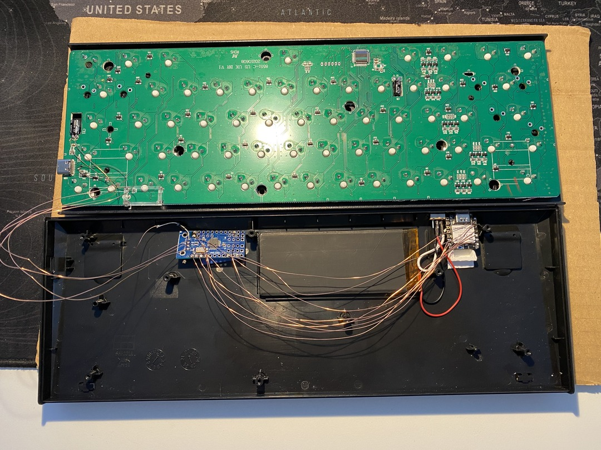

# KeyBLEoard
nRF52840 firmware for converting any USB Keyboard to a BLE HID Keyboard Device.

## Features
- Caps lock LED as BLE connection status indicator
- Report current battery level through the BLE battery service
- Save up to 10 devices for quick switching ~3s (can this be improved upon?)
- (Currently hardcoded) Built-in shortcuts which make using the 60% keyboard, which I built this for, easier

## Hardware 
Besides a USB HID compatible keyboard, the following hardware was used in this project:
- MCU: [SEEED XIAO nRF52840](https://wiki.seeedstudio.com/XIAO_BLE/)
- USB Host Controller: [MAX3421E](https://www.analog.com/en/products/max3421e.html)
- Any 3.4v LiPo which fits the keyboard 

The MCU was selected for its extremly small footprint and the built-in charging and battery protection controller for single-cell LiPos.

## Software
This project uses the the PlatformIO IDE Extension for VSCode which manages all the dependencies.

The nRF52 Arduino Runtime developed by Adafruit was chosen as the basis because the Library for the MAX3421E USB Host Controller was only available and tested as an Arduino Library and I didn't want to invest time porting it to a pure C library (yet?).

To get some kind of task scheduling the [TaskScheduler](https://github.com/arkhipenko/TaskScheduler) library was used for cooperative multitasking. This decision turned out just *okay* so far, as time sensitive tasks are obviously not guaranteed to be run when they're planned to.

In the long term the best solution would be to move to [Zephyr](https://www.zephyrproject.org) or [FreeRTOS](https://www.freertos.org/index.html).
This would also be a good opportunity to clean the code up a bit...